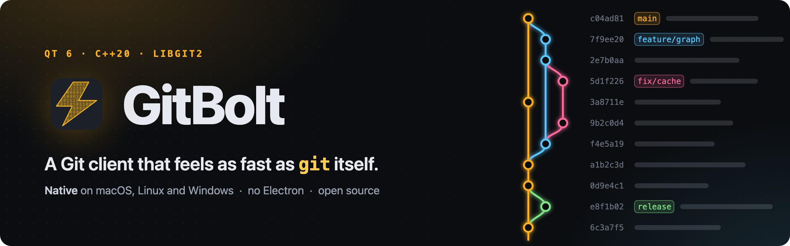
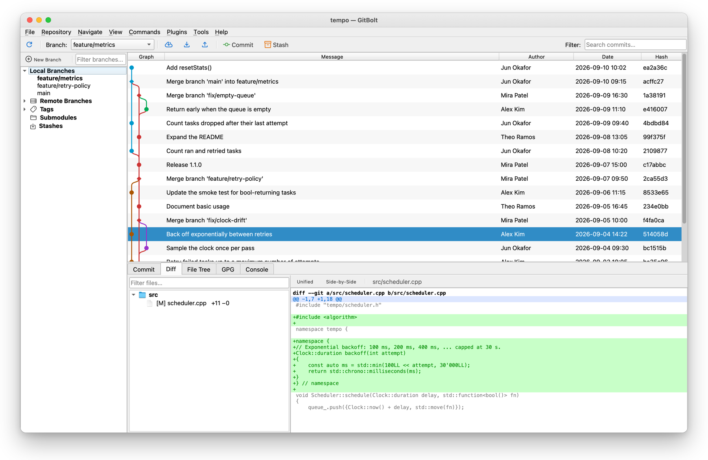
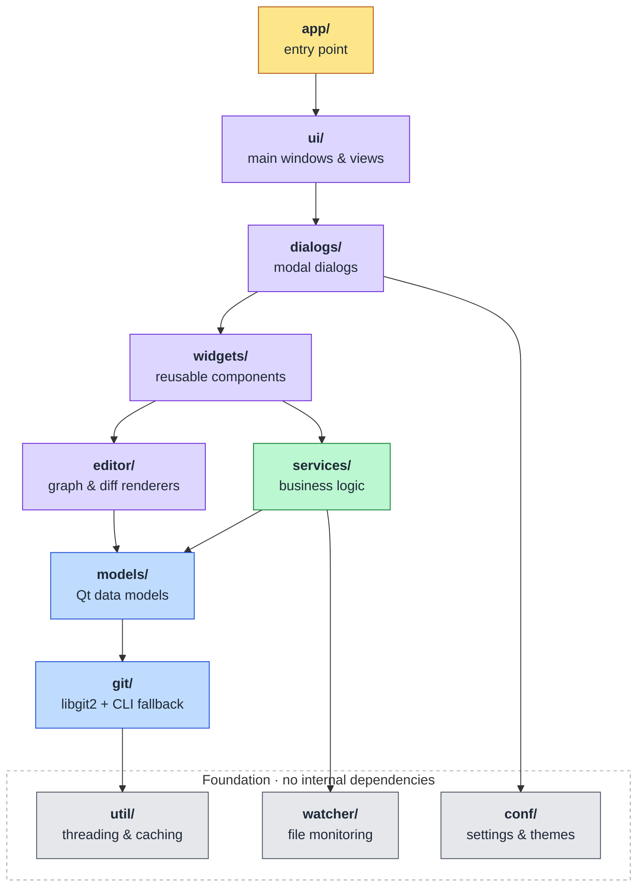

<p align="center">
  <a href="https://www.gitbolt.com">
    
  </a>
</p>

<p align="center">
  <a href="https://github.com/ThePieMonster/GitBolt/actions/workflows/ci.yml"></a>
  <a href="https://github.com/ThePieMonster/GitBolt/releases"></a>
  <a href="LICENSE"></a>
  <a href="#download"></a>
  <a href="https://www.gitbolt.com"></a>
  <br>
  <a href="https://www.qt.io"></a>
  <a href="docs/BUILDING.md"></a>
  <a href="https://libgit2.org"></a>
  <a href="https://github.com/ThePieMonster/GitBolt/commits/main"></a>
</p>

<p align="center">
  <strong>Fast, cross-platform Git GUI client built with Qt 6, C++, and libgit2.</strong>
</p>

<p align="center">
  <a href="https://www.gitbolt.com"><b>Website</b></a> &nbsp;·&nbsp;
  <a href="#download"><b>Download</b></a> &nbsp;·&nbsp;
  <a href="docs/BUILDING.md"><b>Build from source</b></a> &nbsp;·&nbsp;
  <a href="CHANGELOG.md"><b>Changelog</b></a> &nbsp;·&nbsp;
  <a href="CONTRIBUTING.md"><b>Contributing</b></a>
</p>

<p align="center">
  
</p>

GitBolt is a high-performance, feature-complete Git client for macOS, Linux, and Windows. Built natively in C++ with Qt 6 for maximum rendering performance and minimal resource usage.

---

## Why GitBolt?

Most desktop Git GUIs today are either Electron-based (dragging a full JavaScript runtime along for the ride) or expensive commercial native apps — and Linux options are especially thin. GitBolt fills the gap with a single codebase that delivers:

- **Native performance** — Qt 6 with libgit2, no Electron, no JavaScript runtime
- **Power user features** — Interactive rebase, blame drill-down, three-way merge, Git Flow
- **Lightweight** — Compiled binary, hardware-accelerated rendering
- **Cross-platform** — Identical experience on macOS, Linux, and Windows
- **Scriptable** — env-gated test/automation bridge drives the full UI
  from scripts and AI agents (see docs/AGENT_TESTING.md)

---

## Download

Installers for every release are on the
[Releases page](https://github.com/ThePieMonster/GitBolt/releases), newest first.

| Platform | Download | Notes |
|---|---|---|
| macOS | `GitBolt-<version>-Darwin-arm64.dmg` | Apple Silicon, macOS 13 (Ventura) or later |
| Windows | `GitBolt-<version>-Windows-AMD64.exe` | 64-bit installer |
| Linux | `GitBolt-<version>-x86_64.AppImage` | x86-64, portable: make it executable and run it |
| Debian, Ubuntu | `gitbolt_<version>_amd64.deb` | x86-64 |

Each release also lists the files' SHA-256 checksums in `SHA256SUMS.txt`.

---

## Features

### Core Git Operations
- Visual revision graph with lane-based topology rendering
- Side-by-side and unified diff viewer with syntax highlighting
- File-level staging with per-file and stage-all/unstage-all flows
- Interactive rebase with drag-and-drop reordering and
  continue / skip / abort controls for conflicted rebases
- Cherry-pick with multi-commit selection
- Stash save/apply/pop/drop with diff preview
- Branch management (create, delete, rename, checkout, merge,
  push, set-upstream — from the sidebar context menu or Commands)
- Clone, push, pull, fetch with credential helper integration

### Repository Inspection
- Commit log with paged loading (handles 100K+ commits smoothly)
- File history with rename tracking (File Tree → Show History,
  jump the revision graph to any revision that touched the file)
- Reflog viewer with checkout and reset (soft / mixed / hard)
  recovery actions on any entry
- Search by message, author, date range, file content (pickaxe), or file path

### Repository Management
- Tag management (annotated and lightweight)
- Submodule operations (init, update, sync, deinit)
- Worktree creation (new working trees on any branch)
- Git Flow workflow integration
- Repository maintenance (gc, prune, fsck, repack) with disk stats
- Multi-repository session support

### User Experience
- Non-blocking repository open — the repo view appears instantly with
  a loading spinner while commits, branches, and status stream in from
  worker threads (no UI freeze even on huge working trees)
- Built-in terminal (Console tab, Tools → Git bash) opened in the
  repository: your login shell under a PTY on macOS and Linux, cmd.exe
  under ConPTY on Windows (10 1809 or later). Plain text for now, no
  colors or full-screen programs
- Light, Dark, and System theme modes
- Customizable code font and tab size
- Configurable keyboard shortcuts
- Recent repositories with drag-and-drop, max-count + alphabetical-sort
  + path-shortening preferences
- Configurable default window size (with min-size enforcement) and a
  single global default size for every popup dialog; both with optional
  "restore previous" persistence per launch
- Per-dialog geometry persistence so each popup remembers its last
  drag-resized shape independently
- "Contained in branches" lookup on every commit detail (resolves via
  `git branch --all --contains` so it covers both local and remote
  tracking branches)
- File-status legend tooltip in the Commit dialog headers (hover the
  ⓘ icon to see what M / A / D / R / U / ? mean)
- Built-in background tools:
  - Periodic fetch with new-commit notifications
  - Repository statistics summary

### Platform Integration
- macOS Finder Sync extension ("Open in GitBolt" context menu)
- Windows Explorer shell extension
- Linux Nautilus extension and `.desktop` file
- Cross-platform installers (DMG, NSIS, DEB, AppImage)

---

## Architecture

GitBolt uses an **11-module architecture** following Qt convention with strict single-responsibility:

```
src/
├── git/        Core git operations (libgit2 wrappers + CLI fallback)
├── conf/       Settings persistence and theme management
├── watcher/    File system monitoring
├── util/       Threading, caching, performance, crash handling
├── models/     Qt data models (QAbstractItemModel subclasses)
├── services/   Business logic orchestration (GitService, RepoManager)
├── editor/     Custom renderers (revision graph delegate, syntax highlighter)
├── widgets/    Reusable UI components (graph, diff, staging, blame, etc.)
├── ui/         Main windows and views (MainWindow, RepositoryView, Dashboard)
├── dialogs/    Modal dialogs (clone, settings, rebase, merge, etc.)
└── app/        Application entry point and platform-specific integrations
```

### Module Dependency Graph



An arrow means *depends on*; edges already implied by a longer path are left out.
Colours mark the layers: foundation, git core, business logic, presentation, entry point.

Each module is a separate CMake `STATIC` library, enforcing clean dependency boundaries and enabling fast incremental builds.

### Key Design Decisions

| Decision | Rationale |
|----------|-----------|
| **Qt 6 + C++20** | Maximum native performance, mature widget system, hardware-accelerated rendering |
| **libgit2 primary, git CLI fallback** | libgit2 for local repository access, including the hot path (log, diff, blame, status); the CLI for network operations (clone, fetch, pull, push, with git's own SSH and credential setup), interactive rebase, git-flow |
| **Headers and sources together** | Qt convention; matches Gittyup, KeePassXC, FreeCAD |
| **PascalCase filenames** | Qt convention (`QMainWindow.h` style) |
| **Background threading via QtConcurrent** | All git ops run on worker threads with QFutureWatcher signals back to UI |
| **Paged commit log model** | `fetchMore()` with 256-row pages and incremental lane computation |
| **Lane-based revision graph** | Greedy lane assignment with bezier merge curves, custom QStyledItemDelegate |

---

## Building from Source

For full step-by-step instructions on installing dependencies and building GitBolt on **macOS**, **Windows**, and **Linux**, see **[docs/BUILDING.md](docs/BUILDING.md)**.

The short version, once your environment is set up:

```bash
git clone https://github.com/ThePieMonster/GitBolt.git
cd GitBolt
cmake -B build -DCMAKE_BUILD_TYPE=Release -G Ninja
cmake --build build --parallel
```

Required tools at a glance:

| Dependency | Minimum version |
|---|---|
| C++ compiler | C++20 (Apple Clang 14+, GCC 11+, MSVC 19.30+) |
| CMake | 3.21 |
| Qt | 6.5 (6.9.2 on macOS) |
| libgit2 | 1.7, or none: `-DGITBOLT_BUNDLED_LIBGIT2=ON` builds the pinned 1.9.7 |

On macOS with a current Xcode SDK, Qt before 6.9.2 fails to link: its CMake
package still requests the AGL framework, which the SDK no longer ships.
CI builds with Qt 6.10 on all three platforms and libgit2 1.7 on Linux; on
macOS and Windows it builds libgit2 1.9.7 from source and links it
statically. libgit2 only accesses local repositories: network operations
run the `git` CLI, with git's own SSH and credential configuration. The
macOS app runs on macOS 13 (Ventura) or later, the oldest release Qt 6.10
supports.

See [docs/BUILDING.md](docs/BUILDING.md) for how to install each of these on your platform, configure CMake, run the tests, build installers, and troubleshoot common issues.

---

## Project Status

GitBolt **0.9.3** is a beta: every planned module is implemented and
wired into the UI, and CI builds and tests it on macOS, Linux, and Windows.
See [CHANGELOG.md](CHANGELOG.md) for what each release contains.

### Roadmap

The scaffolded-but-unwired backlog has been cleared — **blame view**,
**three-way merge conflict resolution**, **hunk / line-level staging**,
**worktree remove / lock**, and **clone cancellation** are all wired in
and reachable from the UI.

Remaining deferred work:

- **GPG signature verification** — the commit inspector's signature tab
  is an intentional placeholder; signature checking is not implemented
  yet.

---

## License

GitBolt is licensed under the **GNU General Public License v3.0** (GPL-3.0).

This means you are free to:

- **Use** GitBolt for any purpose, including commercial use
- **Study** the source code and learn from it
- **Modify** the source code to suit your needs
- **Distribute** your modifications, provided they are also licensed under the GPL-3.0
- **Contribute back** to the official GitBolt project

In exchange, the GPL requires that:

- Modified versions you distribute must remain under the GPL-3.0
- You must make the source code available with any binary distribution
- You must preserve copyright notices and license information
- You cannot impose additional restrictions on the recipients of your distribution

See [LICENSE](LICENSE) for the full GPL-3.0 text.

### Trademark

The name **"GitBolt"** and the GitBolt logo are **trademarks** of the GitBolt project, protected separately from the source code license. The GPL grants you rights to the source code, but not to the name or logo.

If you fork GitBolt under the GPL, you are required to **rebrand** your fork — choose a different name and use a different logo. This is the same approach used by Firefox, Visual Studio Code, Chromium, and Krita, and protects users from confusion about what is the official GitBolt project.

See [TRADEMARK.md](TRADEMARK.md) for the full trademark policy.

### Contributing

Contributions are welcome! See [CONTRIBUTING.md](CONTRIBUTING.md) for guidelines on reporting bugs, suggesting features, and submitting pull requests.

---

<p align="center">
  <sub>
    <a href="https://www.gitbolt.com">gitbolt.com</a> &nbsp;·&nbsp;
    Licensed under the <a href="LICENSE">GPL-3.0</a> &nbsp;·&nbsp;
    “GitBolt” and its logo are <a href="TRADEMARK.md">trademarks</a>
  </sub>
</p>
